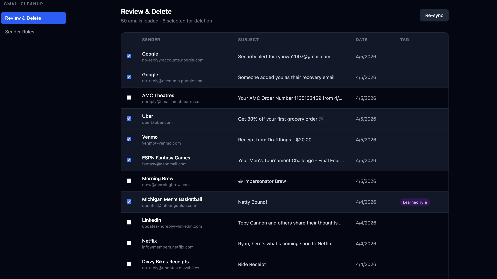
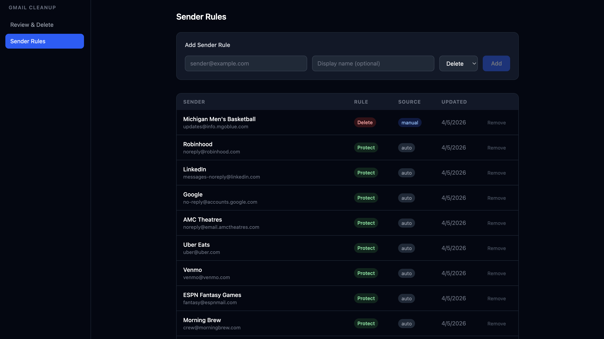

# Gmail Cleanup Tool

A locally-hosted web app that connects to your Gmail account via OAuth and helps you bulk-manage, filter, and clean up emails. Everything runs on your machine — no data is sent to any third-party server beyond the Gmail API.

## Screenshots





## What it does

- Loads your 1,000 most recent emails and scores each one for "promotional likelihood" using local heuristics (no external AI calls)
- Pre-selects likely junk for deletion — newsletters, promotions, no-reply senders, etc.
- Lets you review and deselect anything before confirming a bulk delete
- Learns from your choices: senders you delete get auto-flagged for future sessions; senders you keep get protected
- Surfaces a Sender Rules view so you can manually manage your delete/protect list

## Tech stack

| Layer    | Technology                    |
|----------|-------------------------------|
| Backend  | Python 3.11+ / FastAPI        |
| Frontend | React + TypeScript + Tailwind |
| Auth     | Google OAuth 2.0              |
| Storage  | Local SQLite (metadata cache) |

## Prerequisites

- Python 3.11+
- Node 18+
- A Google Cloud project with the **Gmail API** enabled and an **OAuth 2.0 Desktop app** credential created

## Setup

### 1. Google Cloud credentials

1. Go to the [Google Cloud Console](https://console.cloud.google.com/) and create a project (or use an existing one).
2. Enable the **Gmail API** for the project.
3. Create an **OAuth 2.0 Client ID** — choose **Desktop app** as the application type.
4. Download the credentials and note your `client_id` and `client_secret`.
5. In the OAuth consent screen, add your Gmail address as a **test user** (required while the app is in Testing mode).

### 2. Configure environment

```bash
cp .env.example .env
```

Edit `.env` and fill in your credentials:

```
GOOGLE_CLIENT_ID=your_client_id_here
GOOGLE_CLIENT_SECRET=your_client_secret_here
PORT=8080
```

### 3. Backend

```bash
cd backend
python -m venv venv
source venv/bin/activate        # Windows: venv\Scripts\activate
pip install -r requirements.txt
uvicorn main:app --host 127.0.0.1 --port 8080
```

### 4. Frontend

```bash
cd frontend
npm install
npm run dev
```

Open `http://localhost:5173` in your browser.

### 5. Authenticate

On first load you'll see a **Connect Gmail** screen. Click the button — your browser will open Google's OAuth consent screen. After approving, you'll be redirected back and the app will begin syncing.

OAuth tokens are stored at `~/.gmail-cleanup/token.json` with `chmod 600` permissions and never leave your machine.

## How it works

1. **Sync** — fetches up to 1,000 email metadata records (sender, subject, date, labels) and caches them in a local SQLite database. Email bodies are never stored.
2. **Classify** — each email is scored 0–100 for promotional likelihood using signals like `List-Unsubscribe` headers, Gmail labels (`CATEGORY_PROMOTIONS`, `IMPORTANT`, etc.), and known no-reply sender patterns.
3. **Review** — emails scoring above the threshold (60) are pre-selected for deletion. You can deselect any before confirming.
4. **Delete** — a single `batchDelete` API call removes up to 1,000 emails at once, minimizing Gmail API usage.
5. **Learn** — senders whose emails you deleted get a `delete` rule; senders you deselected get a `protect` rule. These persist in SQLite and apply automatically on future syncs.

## Security notes

- The backend binds to `127.0.0.1` only — it is not accessible from other machines on your network.
- No email body content is ever written to disk.
- All network traffic goes directly to `googleapis.com` and `accounts.google.com`.
- You can revoke access and clear the local cache from within the app.

## Running tests

```bash
# Backend
cd backend
pytest

# Frontend
cd frontend
npm test
```
